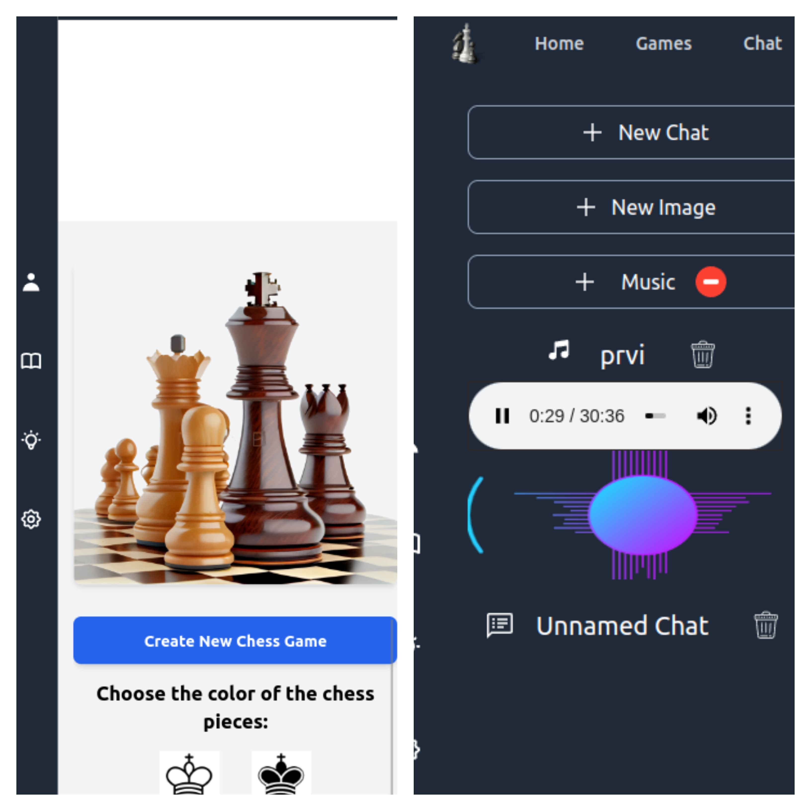

# OpenAI Chess Chat and Image Generation App - README

## Introduction

Welcome to the README file for the OpenAI Chess Chat and Image Generation App. This open-source application, a condensed version of the original, is designed to facilitate chat interactions with the OpenAI GPT-3.5 Turbo model and create images based on textual descriptions. The full application was initially developed for a US-based client, offering additional functionalities like game analysis and AI-powered camera input. However, this abbreviated version focuses on the chat and image generation capabilities.

Please note that the complete codebase, including features such as game analysis and camera input, is not publicly available in this repository. The purpose of this release is to provide insight into the OpenAI integration and image creation components.

## Technologies Used

- **Ruby on Rails**: The application is built using the Ruby on Rails framework, providing a solid foundation for creating web applications.

- **Sidekiq**: Sidekiq is used for asynchronous job processing, ensuring efficient handling of tasks such as image generation and OpenAI interactions.

- **OpenAI API**: The application integrates with the OpenAI API to leverage the power of GPT-3.5 Turbo for chat interactions and image creation.

## Features

- **Chat with OpenAI**: Engage in conversations with the OpenAI GPT-3.5 Turbo model regarding chess-related topics, strategies, and inquiries.

- **Image Generation**: Create visual representations of chess positions using text-based commands and the OpenAI model's assistance.

## Getting Started

1. Clone or download this repository.

2. Install frontend dependencies using `yarn install`.

3. Install backend dependencies using `bundle install`.

4. Run the Sidekiq background job processor using `bundle exec sidekiq`.

5. Set up your OpenAI API keys in the appropriate configuration file. You can obtain API keys for **ChatGPT 3.5 Turbo** or, if you have access, for **ChatGPT 4** by visiting [OpenAI API Keys](https://platform.openai.com/account/api-keys).

6. Start the Rails server using `rails server`.

7. Access the application through your web browser at `http://localhost:3000`.

## Contact

If you have questions or need further information about this project, please contact us at dejanvu.developer@gmail.com.

---

Thank you for exploring the OpenAI Chess Chat and Image Generation App! We hope that this simplified version provides you with insights into utilizing OpenAI's capabilities for chat interactions and image creation.
